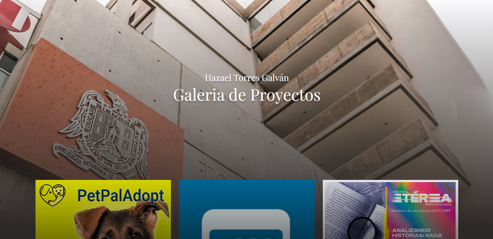
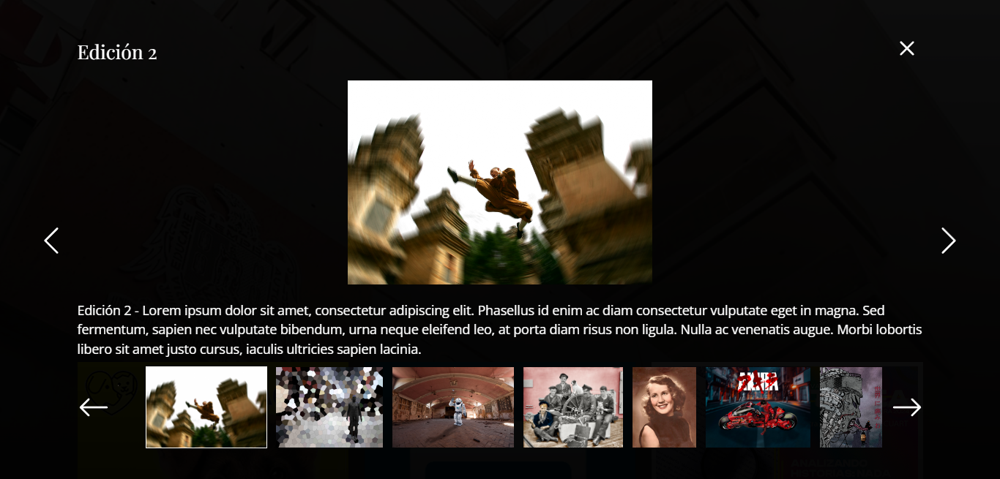

# Proyecto Galería :tw-1f4f7:

Proyecto web que muestra una serie de imágenes divididas en catálogos según su contenido. Además, incluye una previsualización del contenido de cada sección al ser seleccionada y un carrusel interactivo con las imágenes contenidas en dicha sección.

## Tabla de Contenidos

1. [Descripción](#descripción)
2. [Tecnologías Utilizadas](#tecnologías-utilizadas)
3. [Características](#características)
4. [Licencia](#licencia)
5. [Contacto](#contacto)

## Descripción

El proyecto consiste en una galería de imágenes que funciona como un mini portafolio. Las imágenes están organizadas en catálogos temáticos, permitiendo una fácil navegación y visualización. Esta galería interactiva fue adaptada de un ejercicio del curso "JavaScript: El Curso Completo, Práctico y desde Cero". Originalmente, la funcionalidad dividía las imágenes por continentes, pero se modificó para mostrar evidencia de proyectos propios realizados en Figma y de proyectos hechos en Photoshop durante cursos en el Centro Universitario de las Artes (CUART).

## Tecnologías Utilizadas

-  Utilizado para el entorno de desarrollo.
-  Utilizado para la gestión de módulos y el empaquetado del proyecto.
-  Utilizado para el preprocesamiento de CSS.
-  Entorno de programación utilizado.
-  Lenguaje principal utilizado para la interactividad.
-  y  Utilizados para la estructura y el estilo básico del proyecto.

## Características

- **Carrusel Interactivo**: Implementación de diversas funciones en JavaScript que permiten tener un carrusel interactivo dentro de la galería de imágenes.
- **Navegación de Catálogos**: En la página principal se muestra el catálogo de imágenes dividido en categorías. Al hacer clic en una categoría, se muestra el conjunto de imágenes correspondiente.
- **Previsualización de Imágenes**: Al hacer clic en una imagen dentro del carrusel, se muestra una previsualización de la imagen actual. Los botones permiten desplazar la imagen y cerrar el catálogo actual.

## Licencia

Este proyecto está licenciado bajo el instructor Carlos Arturo Esparza, Desarrollador Web y Fundador de FalconMasters. El curso del que forma parte es "JavaScript: El Curso Completo, Práctico y desde Cero".

## Contacto

-  [ChaloTorresG](https://twitter.com/ChaloTorresG)
-  [@_chalotorres](https://instagram.com/_chalotorres)
-  [Hazael Torres](https://www.linkedin.com/in/hazaeltorres/)
